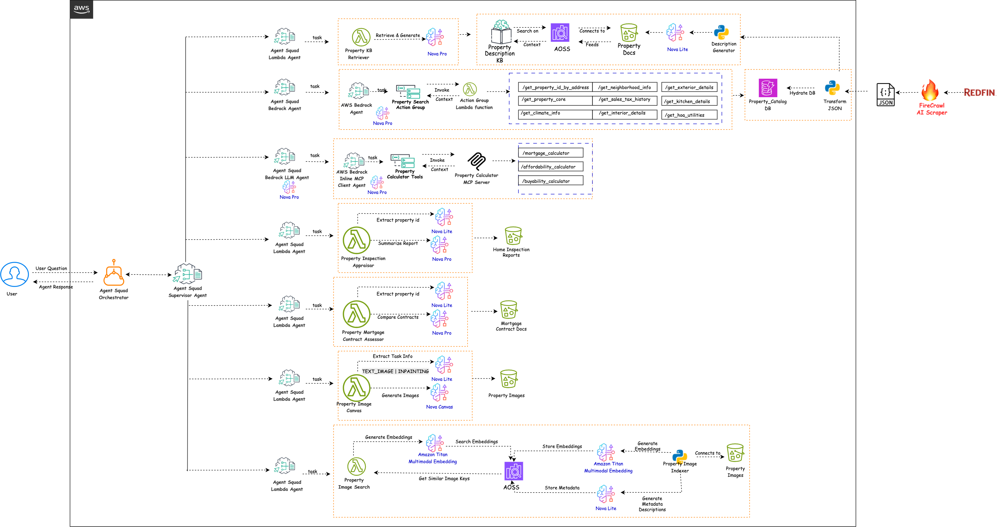

## Challenge:
Real estate agencies are under pressure to stand out in a competitive market by offering more value-added services. The home-buying journey remains complex and overwhelming for clients, involving manual research, document review, and financial comparisons. This leads to longer buying cycles, decision fatigue, and reduced customer satisfaction. Agencies often lack scalable tools to support buyers efficiently through this process

## Solution:

Our GenAI-powered "Real Estate Buyer Assistant" helps real estate agencies deliver a premium, tech-enabled experience by guiding buyers through every step of the home-buying journey. It enables natural language property search, automated summarization of inspection and mortgage contract documents, repair cost estimation, staging a property, finding similar properties based on image, a MCP server that provides calculators such as mortgage, buyability, and affordability, and voice-enabled Q&A. This reduces buyer friction, speeds up decision-making, and helps agencies close deals faster while standing out with a modern, customer-first offering

## Real Estate Buyer AI Assistant - Architecture Diagram

## Solution Details:

The highlights of different Nova models used in the solution is depicted in the architecture flow.

* The solution primarily uses AWS Agent Squad Multi-Agent framework - https://github.com/awslabs/agent-squad for classifying, orchestrating multiple AI agents
* After sample properties are crawled, transformed and stored in DynamoDB, Nova Lite model is used to create 8 to 10 sentences of property description of JSON data, stored in S3, indexed in AWS OpenSearch Serverless Vector DB with property description as embeddings and metadata such as property_id, address, price, etc, and a Bedrock Property KB Retriever Knowledge Base is created on top of this Vector DB
* Property Knowledge Base Retriever Agent takes user's natural language property search query, invokes a Lambda function that interacts with the above Knowledge base using RetrieveAndGenerate function. It used Nova Pro model to retrieve matching properties based on user descriptions
* Property Search Agent uses AWS Bedrock Agent that is configured with Lambda Action Group containing multiple tools. This agent uses Nova Pro model to convert user's query about specific property such as Neighbourhood details, interior/exterior features, sales & tax history, etc. The tools in the action group interacts with DynamoDB.
* Property Calculator Agent uses Agent Squad BedrockLLMAgent that uses Nova Pro model to convert user queries into function parameters. These parameters are passed into another function that uses Bedrock Inline Agent that acts as a MCP client and uses Nova Pro model to invoke appropriate tool on the MCP server. An MCP server provides 3 tools: Mortgage, Buyability, and Affordability calculator implemented Python MCP. 
* Property Inspection Appraiser Agent uses Agent Squad Lambda Agent that goes through home inspection report summary of a property stored in S3 and provides Fannie Mae property condition and quality rating scores and estimates approximate repair cost range. This Agent uses Nova Lite to extract the property id from user query and Nova Pro to provide Fannie Mae ratings by going thru the inspection report and approx. repair cost
* Property Mortgage Contract Assessor Agent uses Agent Squad Lambda Agent that extracts property id from user query using Nova Lite, goes thru multiple mortgage contracts received from different lenders for a property, compares them using Nova Pro and provides which contract is more buyer friendly with respect to fine prints related to Prepayment penalties, Escrow management, Default handling and grace periods, Dispute resolution process, and Recourse and personal liability terms
* Property Image Canvas Agent uses Agent Squad Lambda Agent that extracts image generation task type such as TEXT_IMAGE or INPAINTING based on user query using Nova Lite, and either generate similar variation property images (make Kitchen cabinets olive green from white) based on provided image or replace certain objects in an property image (replace left side grass with kids friendly mini golf course) using Nova Canvas
* Property Image Search Agent uses Agent Squad Lambda Agent that takes user provided query along with exterior house image path (from Streamlit), extracts the image path from the user query using Nova Lite, creates multimodal embedding using Amazon Titan Multimodal Embedding, search similar embeddings in OpenSearch Serverless Vector DB that contains multimodal embeddings of different property exterior images, and returns the metadata of similar property image paths in S3. A batch process takes several exterior house images from S3, creates multimodal embeddings using Amazon Titan Multimodal Embedding and Nova Lite to generate metadata description of an image including the style and look of an exterior property image, location of S3 path and store them as metadata in OpenSearch Serverless Vector DB.
